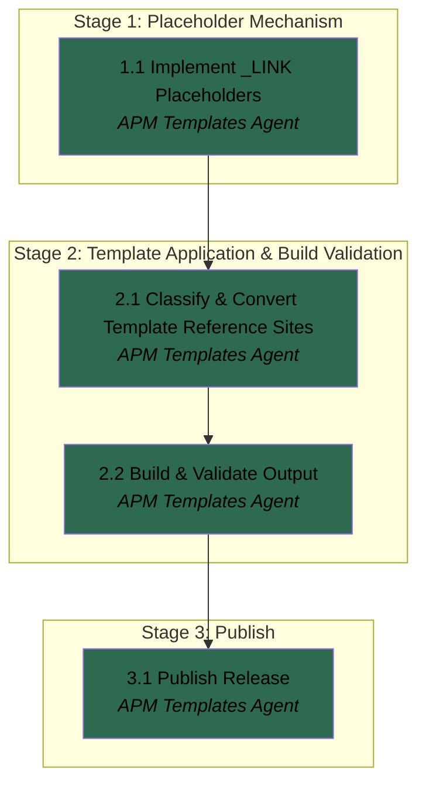

# APM Plan

## Workers

| Worker | Domain | Description |
|--------|--------|-------------|
| APM Templates Agent | APM build & template customization | Implements the `_LINK` placeholder mechanism, classifies and converts template reference sites per skogai-routing conventions, builds and validates output, and publishes the release. |

## Stages

| Stage | Name | Tasks | Agents |
|-------|------|-------|--------|
| 1 | Placeholder Mechanism | 1 | APM Templates Agent |
| 2 | Template Application & Build Validation | 2 | APM Templates Agent |
| 3 | Publish | 1 | APM Templates Agent |

## Dependency Graph

---

> **Notes:** Single-Worker Plan by design — the User confirmed one domain is enough for this run, so every dependency below is same-agent (solid edges only; no cross-agent chains exist to bold). If a Handoff occurs, it will be a context handoff within the APM Templates Agent role, not a cross-agent one — nothing here plans for it, but nothing precludes the Manager triggering one at runtime if context fills. Stage boundaries were chosen as natural reporting points per the User's stated preference for explicit check-ins at stopping points: Stage 1 proves the mechanism in isolation (unit-testable, no template edits yet), Stage 2 is where the real judgment-heavy work happens (classification against skogai-routing's rules) and ends with a validated build, Stage 3 is the one Stage with real external, visible effect (push + release) and is a good point for a final holistic check before the User treats this as done. Stage 3 is also the natural point to confirm the release is genuinely consumable via `apm custom --repo skogai/skogai-pm`, not just published.

## Stage 1: Placeholder Mechanism

### Task 1.1: Implement `_LINK` Placeholders - APM Templates Agent

* **Objective:** Add `SKILL_LINK`, `COMMAND_LINK`, `GUIDE_LINK`, and `AGENT_LINK` placeholders to `build/processors/placeholders.js` per the Spec's Placeholder Mechanism decision.
* **Output:** Modified `build/processors/placeholders.js`; a new `build/processors/placeholders.test.js` using Node's built-in `node:test`/`node:assert` (no test framework exists in this repo yet — `node:test` requires no new dependency and matches the `>=18` engines requirement); a `"test": "node --test build/"` script added to `package.json`.
* **Validation:** `npm test` passes with coverage for: (a) on the `claude` target, each `_LINK` placeholder resolves to `@` + its `_PATH` counterpart's output; (b) on every other configured target (copilot, antigravity, cursor, opencode, codex), `_LINK` output is identical to `_PATH` output for the same name; (c) all pre-existing placeholder behavior is unchanged (regression guard). Worker verifies autonomously by running the tests.
* **Guidance:** See Spec "Placeholder mechanism" for full rationale (additive, not inferred or global). Mirror the existing pattern — e.g. `replaced.replace(/{SKILL_PATH:([^}]+)}/g, ...)` — for each new placeholder, placed immediately after its `_PATH` counterpart. The `@`-prefix condition is exactly `target.id === 'claude'`; every other target must produce byte-identical output to the corresponding `_PATH` placeholder.
* **Dependencies:** None.

1. Read `build/processors/placeholders.js` in full.
2. Add `SKILL_LINK`, `COMMAND_LINK`, `GUIDE_LINK`, `AGENT_LINK` regex replacements, each producing `@` + the `_PATH` result when `target.id === 'claude'`, else the unprefixed `_PATH` result.
3. Add a `"test": "node --test build/"` script to `package.json`.
4. Write `build/processors/placeholders.test.js` covering the three validation cases, exercised against all six targets defined in `build/build-config.json`.
5. Run `npm test` and confirm all tests pass.

## Stage 2: Template Application & Build Validation

### Task 2.1: Classify & Convert Template Reference Sites - APM Templates Agent

* **Objective:** Review existing `{X_PATH:name}` usages across `templates/**/*.md` against skogai-routing's rule 2 (eager vs. discovery) and the router-vs-content-loader distinction, converting sites that warrant eager loading to the new `_LINK` placeholders.
* **Output:** Updated `templates/**/*.md` files with selected `_PATH` occurrences replaced by `_LINK`; a per-site changelog (site + one-line rule-2 justification) captured for the Stage 3 commit message.
* **Validation:** Every conversion traces to an explicit rule-2 justification recorded at conversion time (not reconstructed afterward); every `_PATH` site in the templates is either explicitly converted or explicitly left as discovery with a one-line reason if the call isn't obvious; a grep pass confirms no malformed `{...}` placeholder syntax remains anywhere in `templates/**/*.md`.
* **Guidance:** Read `references/claude-md-routing-rules.md` and `references/at-linking.md` from the `skogai-routing` skill directly before classifying — don't classify from memory or assumption. The cached path noted in the Spec's Workspace section may have moved; if so, invoke the `skogai-routing` skill instead. This Task is classification and conversion only — see Spec "Scope boundary" — do not restructure template content or organization beyond swapping the placeholder used at a given site.
* **Dependencies:** Task 1.1 (the `_LINK` placeholders must exist before any template can use them).

1. Read `claude-md-routing-rules.md` and `at-linking.md` in full.
2. Grep `templates/**/*.md` for all `{SKILL_PATH:`, `{COMMAND_PATH:`, `{GUIDE_PATH:`, `{AGENT_PATH:` occurrences.
3. For each occurrence, assess against rule 2 and the router-vs-content-loader distinction; convert to the corresponding `_LINK` form where eager loading is warranted.
4. Record each conversion (site + one-line reason) for later use in the Stage 3 commit message.
5. Re-grep to confirm no malformed placeholder syntax remains.

### Task 2.2: Build & Validate Output - APM Templates Agent

* **Objective:** Build the release bundles and confirm the claude target's output contains the expected `@`-links and plain paths at the expected locations, with no regressions to the other five targets.
* **Output:** Fresh `dist/*.zip` bundles for all six targets via `npm run build:release`; a recorded validation pass (files checked, findings).
* **Validation:** `npm run build:release` completes without error; `npm test` still passes; extracting `dist/claude.zip` shows every site converted in Task 2.1 rendered as `@`-prefixed at the expected location; extracting at least one other target's zip shows the same reference sites as unchanged plain paths.
* **Guidance:** Targets are defined in `build/build-config.json`; no target-registry changes are expected from this work — if implementing Task 1.1 required one, that's a signal worth surfacing here rather than letting scope expand silently.
* **Dependencies:** Task 2.1 (converted templates must exist before building).

1. Run `npm run build:release`.
2. Extract `dist/claude.zip` to a scratch directory and check the converted sites for `@`-prefixed paths.
3. Extract at least one other target's zip and confirm the same reference sites remain plain paths.
4. Re-run `npm test` to confirm no regression.

## Stage 3: Publish

### Task 3.1: Publish Release - APM Templates Agent

* **Objective:** Push the validated changes to `origin` and produce a real, installable GitHub Release.
* **Output:** A commit on `origin` (`skogai/skogai-pm`) containing the placeholder mechanism, tests, and template changes; a triggered `release-templates.yml` run; a published GitHub Release with a valid `apm-release.json` manifest.
* **Validation:** `git push` succeeds; the triggered workflow run completes successfully; the resulting release is confirmed to exist with all six target zips attached, including the updated `claude.zip`. This is the final natural stopping point for this project — report the release URL/version back explicitly, per the User's stated preference for explicit reports at stopping points.
* **Guidance:** `gh` is already authenticated (`Skogix`, `repo` scope) — no credential setup needed. The workflow's version input can be left empty (auto-increment patch) unless a reason to override emerges. See Spec "Publishing Path" — no additional approval gate is required before triggering this workflow.
* **Dependencies:** Task 2.2 (build and validation must pass before publishing).

1. Commit the Stage 1-2 changes with a message summarizing the `_LINK` placeholder addition and which sites were converted, using the Task 2.1 changelog.
2. Push to `origin` on the working branch established by the Manager at runtime.
3. Trigger `release-templates.yml` via `gh workflow run` (or hand off the trigger to the User, per the Manager's runtime judgment — no gate is mandated either way).
4. Confirm the release published successfully and report the release URL/version back.
